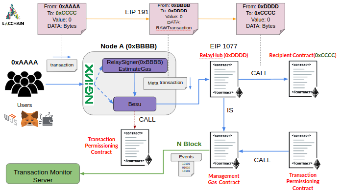
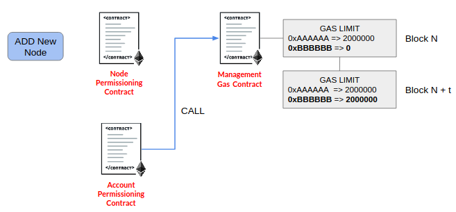
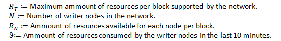
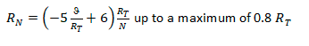
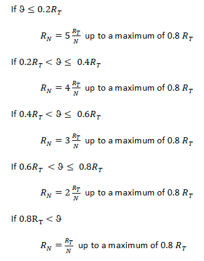
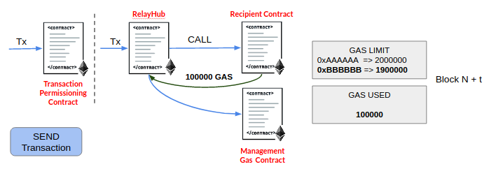
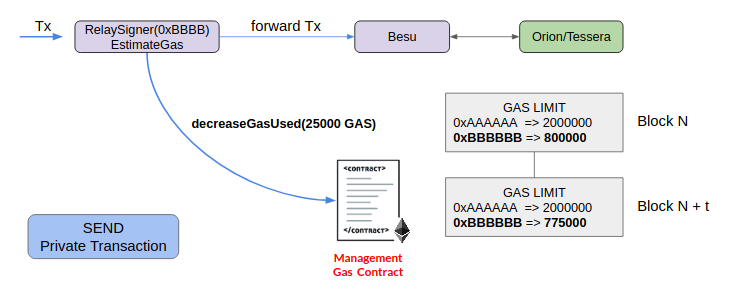
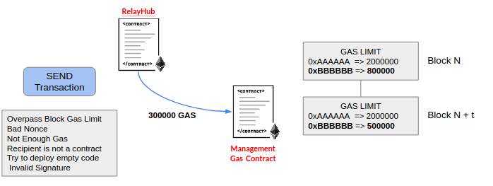
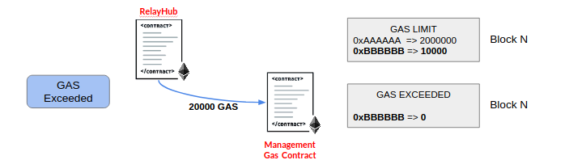
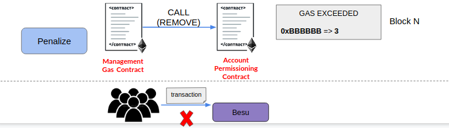

# Solution Architecture

In this section we will review the different components of the architecture, function and relationship with the other components.

If you prefer to go to the practical part of how to adapt your Dapp, you can check [How adapt your Dapp](How_adapt_your_Dapp.md)

## Writer Node Components

A writer node is part of the LACChain network. The node is composed by Nginx, relaySigner layer and Hyperledger Besu.

### Nginx
Its role is act as reverse proxy and SSL termination (terminate HTTPS traffic from clients), it accepts all transactions to the node and forwards them to the RelaySigner. Direct queries to the node do not go through the RelaySigner, in this case nginx redirects them to the RPC port of Besu.

### RelaySigner Layer
Its role is to evaluate the type of message that arrives. In case it is a raw transaction, then the node generates a new transaction encapsulating the original transaction(RLP unsigned from final user or application) in the data field of the new transaction and sends this new transaction to the network. If it is another type of message such as private transactions, get the recipient, block information or get transaction count then the message is directly forwarded to the Besu component.

### Besu
Their role is to be a client of the LACChain network, with which the p2p connection is maintained, broadcast transactions with the other nodes of the network. This component receive transactions from RelaySigner to broadcast to network.

## Smart Contracts

### Node Permission Smart Contract
This smart contract is deployed on the LACChain network. The contract allows connections between the nodes that are registered in the contract. 

Its role in the model is to allow the connection through the TCP protocol of the nodes in the network. Nodes that are not registered in this contract cannot connect to the permissioned network. It means that before two nodes make the connection, they previously verify against this contract if both are allowed to make the connection.

### Transaction Permission Smart Contract
This smart contract is deployed on the LACChain network. The role of this contract is to allow only transactions that satisfy the follow rules:
* Transactions have to be directed towards the RelayHub smart contract.
* Gas price of transaction must be 0.
* Gas limit of transaction must be sufficient to run the entire RelayHub.
* The sender of the transaction must be the same as indicated by the end user or application that generated the transaction. This means that the user or application must sign which writer node will send its transaction and expiration time for its transaction.     

Transactions that do not satisfy these rules will be rejected.

### Local Account Permission Smart Contract
Writer nodes can deploy and customize a Local Account Permissioning Contract, which is a permissioning layer that writer node operators can use to filter (by whitelisting) the reliable addresses (senders) they allow to send transactions to the network through their writer node under rules customizable by the writer node operator, so transactions that do not meet the organization requirements are not broadcasted to the network. This allows for each writer node operator to define its own rules to allow transactions to be broadcasted to the network by them. For writer nodes exposed to external users, services, and applications, this is extremely important, because writer node operators will be accountable for those transactions if their node broadcasts them, no matter who the original sender is.

Additionally, writer node operator can determine the maximum amount of GAS Limit that can be sent per transaction to prevent the node from being banned.

When the local permissioning smart contract is active, the transaction reaches the RelaySigner which before sending it to Besu, verifies the rules set by the node operator against the local permissioning contract, in case the rules are met the transaction will be sent to Besu.

A local account permission smart contract is located [here](https://github.com/lacchain/permissioning-smart-contracts/blob/master/contracts/AccountRules.sol)

if you want to change the rules, just modify the "transactionAllowed" function and put your own rules.

### Relay Hub Smart Contract
This contract is based on EIP 1077. The contract receives the user transaction whose data field is decoded by RLP to obtain the parameters of the original transaction, which are the address of the original sender, the gas limit, the nonce, the original data sent and the destination address of this data. 

Then verifies that address which the node of the organization has chosen to send transactions has not reached the gas limit for that block. In case everything is correct, the transaction is forwarded to the recipient contract or create a new smart contract.

### Gas Management Smart Contract
This contract keeps track of how much gas is consumed by each organization's address of the network. It also assigns a new maximum gas limit that each node's address can consume depending on the use of the network in the last blocks.

### Recipient Smart Contract
This contract will be the final destination of the transaction sent by an user or client application. It is the contract that executes the function chosen with parameters sent in the original transaction.

## Behavior

### Add New Node and sender addresses

When a new node is added to the network, it is added in the Node Permissioning Contract. Then the addresses of the senders of the organization, whose node was previously added to the permissioning smart contract, are added to the Transaction permissioning contract.

Then, this last transaction permissioning contract invokes the gas management contract which will set a GAS limit that new node's addresses can use.

### New Gas Address Limit

The frequency with which the new gas limit is set to each participating address of a writer node of the network is every 300 blocks (10 min), this is configurable by the permissioning committee.

The formula as the gas is distributed depends on how much GAS was used in the last blocks frequency (300 blocks, which is configurable). While higher the amount of Gas used among all the organizations, then lower the maximum GAS limit will be. It is very important to mention that the GAS is distributed in the same way among all the members of the network.

### Send Transaction

Each time a transaction is sent to the network, it is first verified against the transaction permissioning contract. The transaction is verified to satisfy the follow rules:

* Transactions have to be directed towards the RelayHub smart contract.
* Gas price of transaction must be 0.
* Gas limit of transaction must be sufficient to run the entire RelayHub.
* The sender of the transaction must be the same as indicated by the end user or application that generated the transaction. This means that the user or application must sign which writer node will send its transaction and expiration time for its transaction.  

In case the transaction does not comply these rules then is canceled and will not be executed and removed from validator's transaction pool. 

After the transaction is verified and accepted, this transaction will go directly to the RelayHub contract where it is verified that the nonce sent is greater than the previous one to guarantee that the transaction is unique and does not repeat itself. Before the transaction is forwarded to a recipient contract, it is verified that the node has not consumed all the assigned GAS, in case the node has enough gas then the transaction is forwarded, after execution in the recipient contract the amount of GAS used is reduced for that address which sent the original transaction.

### Protected Transaction

The GAS model has protected transactions.

Protected transactions are those that ensure that a transaction will only be executed if the writer designated by the end user or application co-signs the transaction and sends it to the network. In addition, the protected transaction has an expiration time in which it must be executed.

Protected transactions are necessary to not allow a same transaction to be sent to two different nodes, trying to make one of them fail and decrease its gas limit.

### Private Transactions

When a private transaction is sent, it goes through the RelaySigner which call to Management Gas contrat to decrease the gas used, which is 25000. Then it redirects the transaction without modifying to the Besu process and this communicates with the Orion/Tessera service which share the transaction with the participating nodes of the private transaction.

It decreases 25000 GAS, because it is the cost of registering the private-mark transaction hash in the public part of the network. At the end of a private transaction this hash is always recorded.

### Bad Transactions

The RelayHub emits a event when a bad or doubtful transaction is sent in following cases:
* The nonce sent is repeated or lower than registered in contract for that user's address.
* The gas limit sent in the transaction exceeds the block logical gas limit set in the contract(it is not the same as the genesis gas limit).
* A transaction sent to a contract that has an empty code.
* A transaction that tries to deploy an empty code contract.
* User transaction has a bad signature.
* In case that execution of the sent transaction exceeds the total GAS assigned to the writer node through which the transaction is sent.

The amount of gas used to execute a bad transaction will also be decremented from the node that sent the transaction.

### Node Ban and DoS

When an organization that owns a address which exceeds the GAS limit assigned to be used in a block, then it will be banned.

If action of exceeding the gas limit assigned occurs in one block address will be banned and transactions will not be accepted from that address. This is because it could be a denial of service attack.

The address banned can be reestablished after the organization has contacted the consensus group.