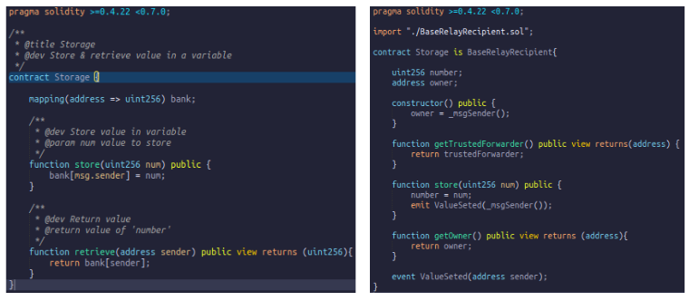

# Solution Architecture

In this section we will review the different components of the architecture, function and relationship with the other components.

## Backend Components

### Node
Is a writer node part of the LACChain network. The node is composed of Nginx, relaySigner layer and Hyperledger Besu.

### Nginx
Its role is act as reverse proxy and SSL termination (terminate HTTPS traffic from clients), it accepts all transactions to the node and forwards them to the RelaySigner.

### RelaySigner Layer
Its role is to evaluate the type of message that arrives. In case it is a raw transaction, then the node generates a new transaction encapsulating the original transaction(RLP unsigned) in the data field of the new transaction and sends this new transaction to the network. If it is another type of message such as contract calls, private transactions, get the recipient, number of connected nodes, block information or transaction then the message is directly forwarded to the Besu component.

### Besu
Their role is to be a client of the LACChain network, with which the p2p connection is maintained, broadcast transactions with the other nodes of the network. This component receive transactions from RelaySigner to broadcast to network.

## Smart Contracts

### Node Permission Smart Contract
This smart contract is deployed on the LACChain network. The contract allows connections between the nodes that are registered in the contract. 

Its role in the model is to allow the connection through the TCP protocol of the nodes in the network. Nodes that are not registered in this contract cannot connect to the permissioned network. It means that before two nodes make the connection, they previously verify against this contract if both are allowed to make the connection.

### Account Permission Smart Contract
This smart contract is deployed on the LACChain network. The role of this contract is to allow only transactions that are directed towards the RelayHub smart contract or the pre-compiled private contract, which is used to send private transactions. As well as only allow transactions from allowed addresses, which are accounts selected by each organization.

Transactions that do not go through the RelayHub or come from non-permissioned addresses will be rejected.

### Relay Hub Smart Contract
This contract is based on EIP 1077. The contract receives a transaction whose data field is decoded by RLP to obtain the parameters of the original transaction, which are the address of the original sender, the gas limit, the nonce, the original data sent and the destination address of this data. 

Then verifies that address which the node of the organization has chosen to send transactions has not reached the gas limit for that block. In case everything is correct, the transaction is forwarded to the recipient contract or create a new smart contract.

### Gas Managenment Smart Contract
This contract keeps track of how much gas is consumed by each organization's address of the network. It also assigns a new maximum gas limit that each node's address can consume depending on the use of the network in the last blocks.

### Recipient Smart Contract
This contract will be the final destination of the transaction sent by an user or client application. It is the contract that executes the function chosen with parameters sent in the original transaction.

## Behavior

### Add New Node and sender addresses

When a new node is added to the network, it is added in the Node Permissioning Contract. Then the addresses of the senders of the organization, whose node was previously added to the permitting contract, are added to the Account permissioning contract.

Then, this last permissioning contract invokes the gas management contract which will set a GAS limit that new node's addresses can use.

### New Gas Address Limit

The frequency with which the new gas limit is set to each participating address of a writer node of the network is every 10 blocks, this is configurable by the consensus group.

The formula as the gas is distributed depends on how much GAS was used in the last blocks frequency (10 blocks, wich is configurable). While higher the amount of Gas used among all the organizations, then lower the maximum GAS limit will be. It is very important to mention that the GAS is distributed in the same way among all the members of the network.

### Send Transaction

Each time a transaction is sent to the network, it is first verified against the account permissioning contract. The transaction is verified to come from a permitted address and is directed to the RelayHub contract or to the pre-compiled private transaction contract.
In case the transaction does not comply these rules then is canceled and will not be executed. 

After the transaction is verified, this transaction will go directly to the RelayHub contract where it is verified that the nonce sent is greater than the previous one to guarantee that the transaction is unique and does not repeat itself. Before the transaction is forwarded to a recipient contract, it is verified that the node has not consumed all the assigned GAS, in case the node has enough gas then the transaction is forwarded, after execution in the recipient contract the amount of GAS used is reduced for that address which sent the original transaction.

### Private Transactions

When a private transaction is sent, it goes through the RelaySigner which call to Management Gas contrat to decrease the gas used, which is 25000. Then it redirects the transaction without modifying to the Besu process and this communicates with the Orion service which share the transaction with the participating nodes of the private transaction.

### Bad Transactions

The RelayHub emits a event when a bad or doubtful transaction is sent in following cases:
- The nonce sent is repeated or lower than registered in contract for that user's address.
- The gas limit sent in the transaction exceeds the logical gas limit set in the contract(it is not the same as the genesis gas limit).
- A transaction sent to a contract that has an empty code.
- A transaction that tries to display an empty code contract.
- In case that execution of the sent transaction exceeds the total GAS assigned to the writer node through which the transaction is sent.

### Node Ban and DoS

When an organization that owns a address which exceeds the GAS limit assigned to be used in a block, then it will be counted as an exceeded limit and informed by mail to the institution of such action. 

The excesses are reset in the following block frequency (every 10), that means that when the 10 blocks generated are completed, the count of excesses of all the writer nodes will be reset to 0 again.

If action of exceeding the gas limit assigned occurs more than 3 times then the address will be banned and transactions will not be accepted from that address. This is because it could be a denial of service attack.

The address banned can be reestablished after the organization has contacted the consensus group.

## How to adapt my contract to this new model

As the sender with which the transactions arrive at the receipient contract is the address of the RelayHub contract, a mechanism is necessary to obtain the original sender of the client or user who sent the transaction. 

To make this possible, we take advantage of the atomicity of the execution of the transactions in the EVM. That is, every time a transaction is sent to the RelayHub, the address of the original sender is stored, which is then retrieved by making a call to the RelayHub from the recipient contract.

This function to obtain the original sender is located in an abstract contract, which has to be inherited by all the contracts that will be deployed in the network.

